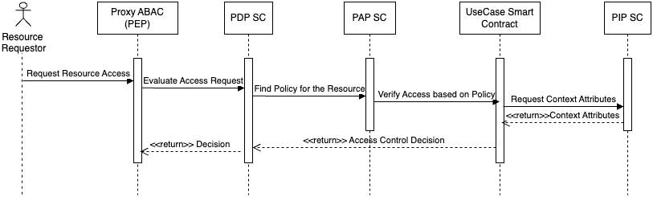

# 📘 Decentralised Access Control ABAC - ExtremeXP Project

There is a flow of communication between the smart contracts when someone requests access to a resource. This request arrives on the ABAC proxy, a Back-End which acts as a PEP (Policy Enforcement Point), and sends the request to the PDP to evaluate if the requestor can access the resource. The PDP and other components are smart contracts running on-chain. PDP asks PAP to find a policy related to a resource, and when PAP finds it, it forwards the request to the use case smart contract related to the resource. In this use case, the smart contract has a policy to enforce on that resource. So, the use case smart contract evaluates the policy and returns the result to the PDP. PDP, then transmit the decision to PEP (Proxy ABAC).

In a future version with the translator of policies, this approach will change a bit, with the decisions concentrated on PDP and the use cases smart contracts will also change to reflect the relationship of all contracts with a new component (translator). 

The figure shows how the interaction is occurring in this version.




## 📂 Project Structure

```bash
.
├── src/
│   ├── PAP.sol                # Policy Administration Point
│   ├── PDP.sol                # Policy Decision Point
│   ├── PIP.sol                # Policy Information Point (context attributes)
│   ├── interfaces/            # Interfaces: IPAP, IPDP, IUseCaseRule
│   ├── Ideko.sol              # Use case: IDEKO
│   ├── I2cat.sol              # Use case: I2CAT
│   ├── Cs.sol                 # Use case: CS
│   ├── Moby.sol               # Use case: MOBY
│   └── Airbus.sol             # Use case: AIRBUS
├── script/
│   └── DeployAccessControl.s.sol  # Foundry deploy script
├── foundry.toml               # Foundry configuration
└── README.md                 # This file

```


 ## Future version.
We will implement a Policy translator and integrate it with these smart contracts. One side of the translator should have been on-chain, and the other off-chain.


## Foundry

This project was developed using Foundry; however, another solidity framework, such as hardhat or remix, can be used. To do it, you need to copy the /src folder content to your preferred framework.

For those who want to use Foundry, below are some commands:


### Usage

#### Build

```shell
$ forge build
```

#### Test

```shell
$ forge test
```

#### Anvil (a simulation of blockchain)

```shell
$ anvil
```

#### Deploy

```shell
$ forge script script/Counter.s.sol:CounterScript --rpc-url <your_rpc_url> --private-key <your_private_key>
```

## Funding
This work was partially funded by European Union's Horizon Program under grant agreement no. 101093164 (ExtremeXP: EXPerimentation driven and user eXPerience oriented analytics for eXtremely Precise outcomes and decisions)

